# ER — maya_dashboard

## Diagrama

```mermaid
erDiagram
    %% PHYSICAL TABLES (app-owned)
    APPLICATIONS ||--o{ USER_FAVORITE_APPLICATIONS : references
    APPLICATIONS {
        bigint id PK
        varchar name
        varchar slug
        text description
        varchar icon
        varchar color
        varchar traefik_url
        boolean is_active
        varchar view_permission_slug
        timestamp created_at
        timestamp updated_at
    }

    USER_FAVORITE_APPLICATIONS {
        bigint id PK
        varchar user_id FK
        bigint application_id FK
        timestamp created_at
        timestamp updated_at
    }

    USER_DASHBOARD_LAYOUTS {
        bigint id PK
        varchar user_id FK
        json layout
        timestamp updated_at
    }

    USERS ||--o{ NOTIFICATIONS : receives
    NOTIFICATIONS {
        bigint id PK
        varchar message_id UK
        varchar app
        varchar type
        varchar recipient_id FK
        varchar title
        text body
        jsonb channels
        jsonb metadata
        boolean is_critical
        varchar scope
        timestamptz acknowledged_at
        uuid acknowledged_by
        timestamptz resolved_at
        uuid resolved_by
        timestamptz created_at
        timestamptz read_at
    }

    ALERT_RULES {
        bigint id PK
        varchar slug UK
        varchar name
        text description
        text query_sql
        enum severity
        varchar schedule_cron
        boolean enabled
        jsonb context_template
        timestamptz last_evaluated_at
        boolean notify_all
        varchar audience_kind
        varchar academic_level
        varchar audience_study_type_id
        varchar audience_study_id
        varchar audience_module_id
        varchar audience_team_id
        varchar created_by_id
        timestamptz created_at
        timestamptz updated_at
    }

    ALERT_RULES ||--o{ ALERTS : references
    ALERTS {
        bigint id PK
        varchar message_id UK
        varchar rule_slug FK
        enum severity
        varchar title
        varchar source
        jsonb context
        timestamptz created_at
        timestamptz acknowledged_at
        varchar acknowledged_by
        timestamptz resolved_at
        varchar resolved_by
    }

    PANEL_ALERT_RULES {
        bigint id PK
        varchar name
        text description
        varchar event_type
        jsonb conditions
        text alert_text
        enum severity
        varchar action_label
        varchar action_url
        unsignedInteger visible_duration_hours
        unsignedInteger max_frequency_minutes
        boolean is_active
        timestamptz last_triggered_at
        varchar created_by
        boolean notify_all
        varchar audience_kind
        varchar academic_level
        varchar audience_study_type_id
        varchar audience_study_id
        varchar audience_module_id
        varchar audience_team_id
        timestamptz created_at
        timestamptz updated_at
    }

    PANEL_ALERT_RULES ||--o{ PANEL_ALERTS : references
    PANEL_ALERTS {
        bigint id PK
        text text
        enum severity
        varchar action_label
        varchar action_url
        timestamptz visible_from
        timestamptz visible_until
        varchar source
        bigint rule_id FK
        varchar created_by
        boolean notify_all
        varchar audience_kind
        varchar academic_level
        varchar audience_study_type_id
        varchar audience_study_id
        varchar audience_module_id
        varchar audience_team_id
        timestamptz created_at
        timestamptz updated_at
    }

    %% FDW ODOO v_app_* (read-only)
    EMPLOYEE_PROFILES {
        varchar user_id PK
        varchar personal_email
        varchar position_type
        varchar supervisor_name
        varchar mentor_name
        varchar keys
        date date_keys_handover
        date date_keys_return
        varchar iban
        varchar id_card_rfid
        varchar car_registration_number_1
        varchar car_registration_number_2
        varchar car_registration_number_3
    }

    BOOKINGS {
        varchar id PK
        varchar user_id
        varchar title
        varchar resource_id
        varchar resource_name
        timestamp start_at
        timestamp end_at
        boolean all_day
        varchar status
    }

    ATTENDANCES {
        varchar id PK
        varchar user_id
        timestamp check_in
        timestamp check_out
        varchar source
    }

    %% FDW ODOO shared-profile-laravel (read-only)
    USERS {
        varchar id PK
        varchar name
        varchar email
        varchar first_name
        varchar last_name
        varchar username
        varchar employee_id
        varchar dni
        varchar employee_type
        boolean is_active
    }

    TEAMS {
        varchar id PK
        varchar name
        text description
        varchar owner_id
        boolean is_department
        timestamp created_at
        timestamp updated_at
        timestamp deleted_at
    }

    TEAM_MEMBERS {
        varchar id PK
        varchar team_id
        varchar user_id
        varchar role
        timestamp created_at
        timestamp updated_at
    }

    USERS ||--o{ TEAM_MEMBERS : references
    TEAMS ||--o{ TEAM_MEMBERS : references

    STUDY_TYPES {
        varchar id PK
        varchar code
        varchar name
    }

    STUDIES {
        varchar id PK
        varchar code
        varchar study_type_id
        varchar name
        boolean active
    }

    STUDY_TYPES ||--o{ STUDIES : references

    COURSE_MODULES {
        varchar id PK
        varchar code
        varchar year
        varchar name
        varchar study_id
    }

    STUDIES ||--o{ COURSE_MODULES : references

    USER_STUDY_TYPES {
        varchar id PK
        varchar user_id
        varchar study_type_id
    }

    USERS ||--o{ USER_STUDY_TYPES : references
    STUDY_TYPES ||--o{ USER_STUDY_TYPES : references

    USER_STUDIES {
        varchar id PK
        varchar user_id
        varchar study_id
    }

    USERS ||--o{ USER_STUDIES : references
    STUDIES ||--o{ USER_STUDIES : references

    USER_COURSE_MODULES {
        varchar id PK
        varchar user_id
        varchar module_id
    }

    USERS ||--o{ USER_COURSE_MODULES : references
    COURSE_MODULES ||--o{ USER_COURSE_MODULES : references

    USER_RESOLVED_PERMISSIONS {
        varchar user_id PK
        varchar permission_slug PK
    }

    USERS ||--o{ USER_RESOLVED_PERMISSIONS : references

    %% FRAMEWORK/SYSTEM TABLES
    JOBS {
        bigint id PK
        varchar queue
        longtext payload
        unsignedTinyInt attempts
        unsignedInt reserved_at
        unsignedInt available_at
        unsignedInt created_at
    }

    JOB_BATCHES {
        varchar id PK
        varchar name
        integer total_jobs
        integer pending_jobs
        integer failed_jobs
        longtext failed_job_ids
        mediumtext options
        integer cancelled_at
        integer created_at
        integer finished_at
    }

    FAILED_JOBS {
        bigint id PK
        varchar uuid UK
        text connection
        text queue
        longtext payload
        longtext exception
        timestamp failed_at
    }
```

## Clasificación de tablas

| Entidad | Mecanismo | Fuente | Evidencia |
|---------|-----------|--------|-----------|
| APPLICATIONS | FDW Odoo (maya_auth, read-only) | maya_auth.applications | 2026_04_22_000000_create_applications_table.php:14–27 |
| USER_FAVORITE_APPLICATIONS | FÍSICA (propia) | Backend | 2026_04_22_000001_create_user_favorite_applications_table.php:14–25 |
| USER_DASHBOARD_LAYOUTS | FÍSICA (propia) | Backend | 2026_04_22_000002_create_user_dashboard_layouts_table.php:14–22 |
| NOTIFICATIONS | FÍSICA (propia) | Backend | 2026_04_24_000001_create_notifications_table.php:11–27 |
| ALERT_RULES | FÍSICA (propia) | Backend | 2026_04_24_000002_create_alert_rules_table.php:11–33 |
| ALERTS | FÍSICA (propia) | Backend | 2026_04_24_000003_create_alerts_table.php:11–30 |
| PANEL_ALERT_RULES | FÍSICA (propia) | Backend | 2026_05_27_000001_create_panel_alerts_tables.php:11–34 |
| PANEL_ALERTS | FÍSICA (propia) | Backend | 2026_05_27_000001_create_panel_alerts_tables.php:36–62 |
| EMPLOYEE_PROFILES | FDW Odoo v_app_* (read-only) | odoo.v_app_employee_profile | 2026_05_28_000005_create_employee_profile_foreign_table.php:27–130 |
| BOOKINGS | FDW Odoo v_app_* (read-only) | odoo.v_app_bookings | 2026_05_22_000002_create_bookings_foreign_table.php:31–128 |
| ATTENDANCES | FDW Odoo v_app_* (read-write parcial: INSERT/UPDATE) | odoo.v_app_attendances | 2026_05_22_000001_create_attendances_foreign_table.php:27–118; 2026_05_22_000003/000004 GRANT |
| USERS | FDW Odoo (shared-profile, read-only) | odoo.v_app_users | shared-profile-laravel/users/2026_05_19_000001_create_users_foreign_table.php:41–144 |
| TEAMS | FDW Odoo (shared-profile, read-only) | odoo.v_dms_teams | shared-profile-laravel/teams/2026_05_18_000001_create_teams_foreign_table.php:27–119 |
| TEAM_MEMBERS | FDW Odoo (shared-profile, read-only) | odoo.v_dms_team_members | shared-profile-laravel/teams/2026_05_18_000002_create_team_members_foreign_table.php:22–113 |
| STUDY_TYPES | FDW Odoo (shared-profile, read-only) | odoo.res_company | shared-profile-laravel/academic-catalogs/2026_05_22_000000_create_study_types_catalog_foreign_table.php:22–105 |
| STUDIES | FDW Odoo (shared-profile, read-only) | odoo.maya_core_study | shared-profile-laravel/academic-catalogs/2026_05_22_000001_create_studies_catalog_foreign_table.php:20–124 |
| COURSE_MODULES | FDW Odoo (shared-profile, read-only) | odoo.maya_core_study_maya_core_subject_rel + odoo.maya_core_subject | shared-profile-laravel/academic-catalogs/2026_05_22_000002_create_course_modules_catalog_foreign_table.php:24–145 |
| USER_STUDY_TYPES | FDW Odoo (shared-profile, read-only) | odoo.res_company_users_rel | shared-profile-laravel/academic-assignments/2026_05_18_000003_create_user_study_types_foreign_table.php:19–131 |
| USER_STUDIES | FDW Odoo (shared-profile, read-only) | odoo.res_company_users_rel + odoo.maya_core_study | shared-profile-laravel/academic-assignments/2026_05_18_000004_create_user_studies_foreign_table.php:17–136 |
| USER_COURSE_MODULES | FDW Odoo (shared-profile, read-only) | odoo.maya_core_subject_employee_rel + odoo.maya_core_employee + odoo.res_users | shared-profile-laravel/academic-assignments/2026_05_18_000005_create_user_course_modules_foreign_table.php:17–139 |
| USER_RESOLVED_PERMISSIONS | FDW Odoo (shared-profile, read-only) | maya_auth.v_portal_user_permissions | shared-profile-laravel/user-permissions/2026_05_18_000010_create_user_resolved_permissions_view.php:28–124 |
| JOBS | Framework/sistema (Laravel Queue) | Backend | shared-messaging-laravel/2026_05_07_000000_create_messaging_jobs_table.php:11–20 |
| JOB_BATCHES | Framework/sistema (Laravel Queue Batches) | Backend | shared-messaging-laravel/2026_05_07_000000_create_messaging_jobs_table.php:22–36 |
| FAILED_JOBS | Framework/sistema (Laravel Queue Failures) | Backend | shared-messaging-laravel/2026_05_07_000000_create_messaging_jobs_table.php:38–48 |

### Tablas de framework/sistema

- **JOBS**: Cola de trabajos (Laravel Queue, redis/database driver)
- **JOB_BATCHES**: Lotes de trabajos (Laravel Batch API)
- **FAILED_JOBS**: Trabajos fallidos retenidos

## Discrepancias

Ninguna — usuario/perfil/asistencias se leen por FDW; resto tablas propias del dashboard. Las columnas `user_id` (varchar UUID keycloak) hacia `users`/`employee_profiles` sin FK física son correctas (FDW read-only no permite FOREIGN KEY). El `attendances` con permisos parciales INSERT/UPDATE es intencional para botones "Fichar" / "Fichar salida".
