# Manual de usuario — Maya Dashboard (frontend)

## 1. Introducción

**Maya Dashboard** es una aplicación web de tipo panel (*dashboard*) desarrollada con React. Permite al usuario, una vez identificado, consultar un catálogo de herramientas, marcar favoritas y revisar o editar sus datos personales.

Este manual describe el uso desde el navegador. La instalación y puesta en marcha en local se detallan en `manual_instalacion.md`.

---

## 2. Acceso y autenticación

1. Abre la URL que te indique el entorno (en desarrollo suele ser `http://localhost:5173`; el puerto exacto lo muestra la terminal al ejecutar `npm run dev`).
2. La aplicación muestra las pantallas de **iniciar sesión** y **registro**.
3. En la versión actual los datos de autenticación son **simulados** (mock): el sistema no valida credenciales contra un servidor real; cualquier email y contraseña no vacíos permiten continuar tras el envío del formulario.
4. Tras un login o registro correcto, se redirige al **panel de herramientas** (`/tools`).
5. Si ya hay sesión iniciada e intentas abrir de nuevo `/login` o `/register`, la aplicación te redirige al panel para evitar duplicar el acceso.

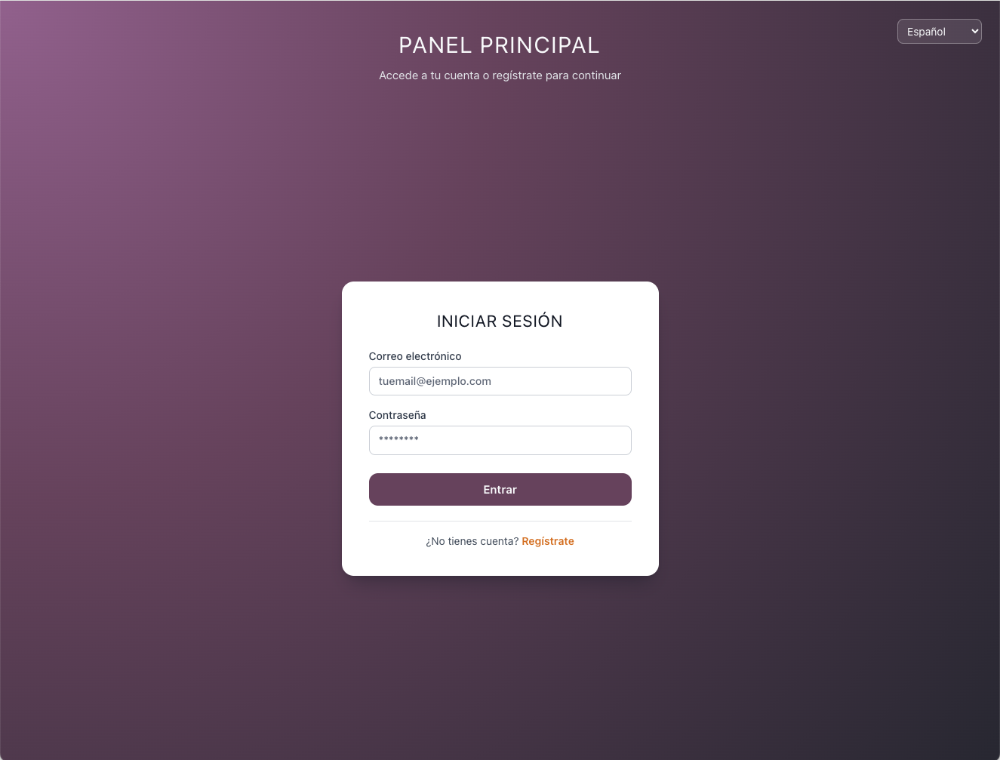

*Figura 1. Pantalla de inicio de sesión.*

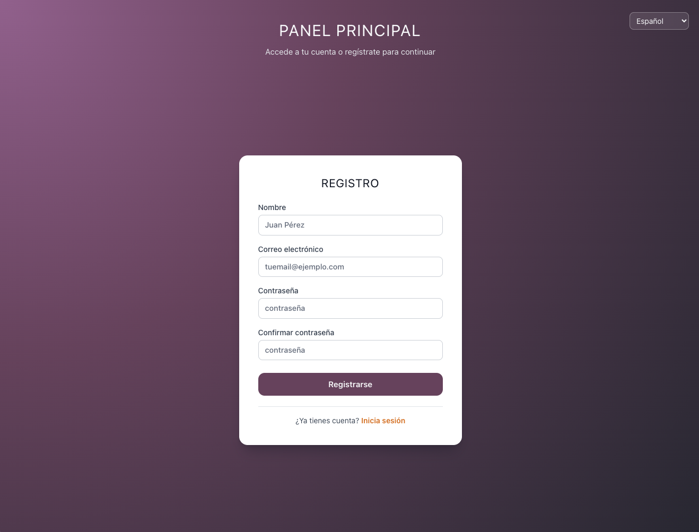

*Figura 2. Pantalla de registro de usuario.*

---

## 3. Idioma

En la barra superior (escritorio) o en el menú móvil puedes cambiar el idioma de la interfaz entre:

- **Español** (por defecto)
- **English**
- **Valencià**

El idioma elegido se guarda en el navegador (`localStorage`) cuando es posible. El atributo de idioma del documento (`lang`) se actualiza para mejorar accesibilidad y lectura por parte del navegador.

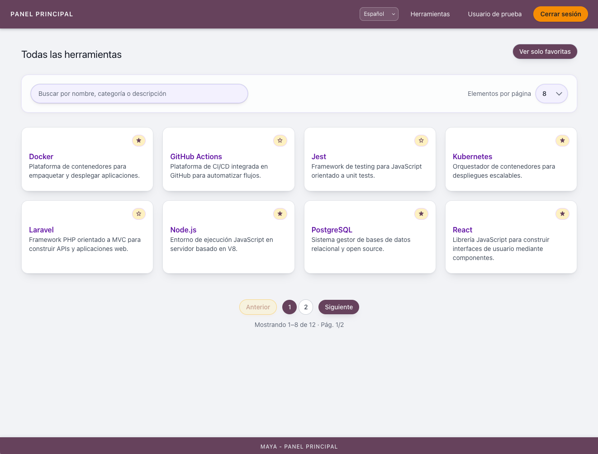

*Figura 3. Panel de herramientas en escritorio: ejemplo con selector de idioma en la barra superior.*

---

## 4. Navegación principal

- **Marca / título** (enlace): lleva al listado de herramientas (`/tools`).
- **Herramientas**: misma vista de catálogo.
- **Datos personales**: ficha de perfil (`/profile`) para ver y, en modo edición, modificar datos de ejemplo.
- **Cerrar sesión**: cierra la sesión simulada y vuelve al login.

En **móvil**, el menú se abre con el icono de menú; puedes cerrarlo tocando fuera o con la tecla **Escape** (accesibilidad). El aspecto del menú desplegado se muestra en la **Figura 7** (apartado 5.3).

---

## 5. Pantalla «Herramientas»

### 5.1 Listado y favoritos

- Puedes alternar entre **todas las herramientas** y **solo favoritas** con el botón correspondiente.
- Cada tarjeta muestra nombre, descripción y, si aplica, fecha de último uso.
- La **estrella** permite añadir o quitar la herramienta de favoritos; se pide confirmación en un cuadro de diálogo.

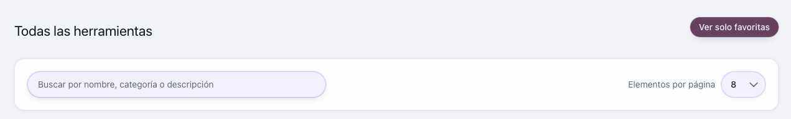

*Figura 4. Detalle de una tarjeta del catálogo.*

### 5.2 Búsqueda

- Campo de búsqueda para filtrar por nombre, categoría o descripción (según el texto mostrado en tu idioma).
- En pantallas pequeñas el texto del campo puede ser más corto para caber junto al resto de controles.

### 5.3 Paginación y «cargar más»

- En **tablet/escritorio**: puedes elegir cuántos elementos ver por página y usar la paginación (anterior/siguiente y números de página).
- En **móvil**: no se muestra la paginación clásica; en su lugar aparece **Cargar más** para ir ampliando el listado.

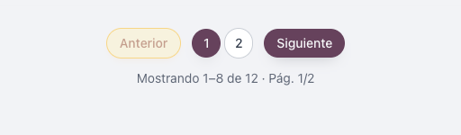

*Figura 5. Paginación y tamaño de página (escritorio).*

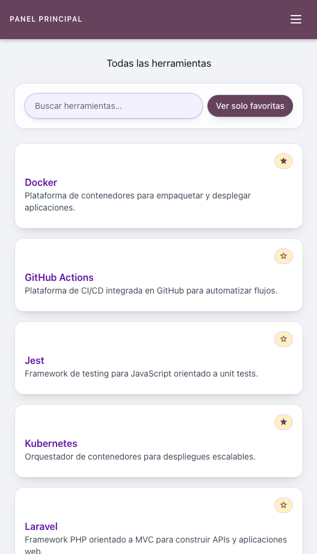

*Figura 6. Listado de herramientas (móvil).*

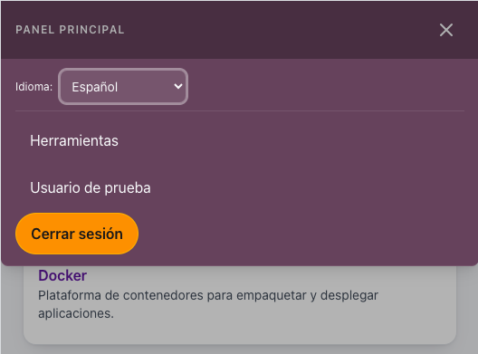

*Figura 7. Menú de navegación (vista móvil).*

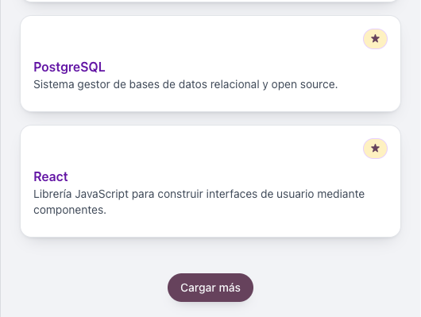

*Figura 8. Ampliar el listado con «Cargar más» (móvil).*

Al usar la **estrella** de favoritos en una tarjeta, la aplicación muestra un cuadro de diálogo de confirmación:

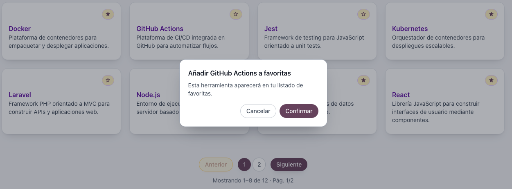

*Figura 9. Diálogo de confirmación al gestionar favoritos.*

---

## 6. Pantalla «Datos personales»

- Muestra información del usuario de demostración.
- **Editar datos** abre el formulario; **Guardar cambios** valida y envía la actualización (mock).
- **Cancelar** descarta los cambios no guardados.

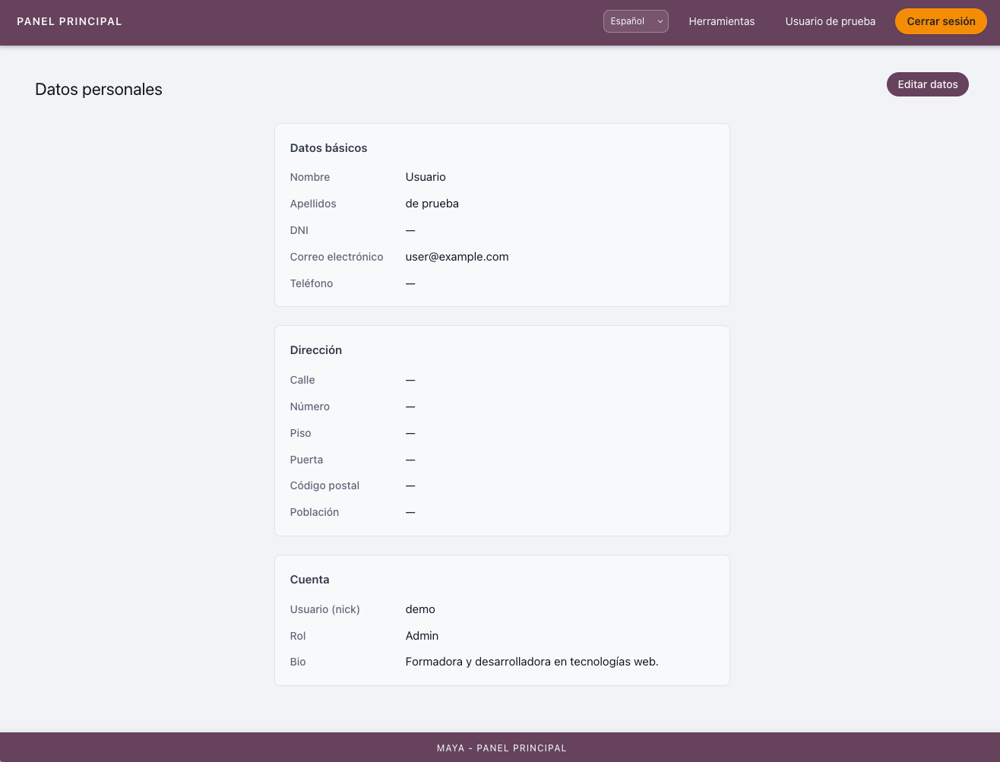

*Figura 10. Pantalla «Datos personales».*

---

## 7. Otras pantallas

- **404**: si la URL no existe, se muestra un mensaje acorde; el botón lleva al panel si hay sesión o al login si no la hay.
- **Error global**: si la interfaz falla de forma inesperada, se ofrece un mensaje y la opción de **recargar** la página.

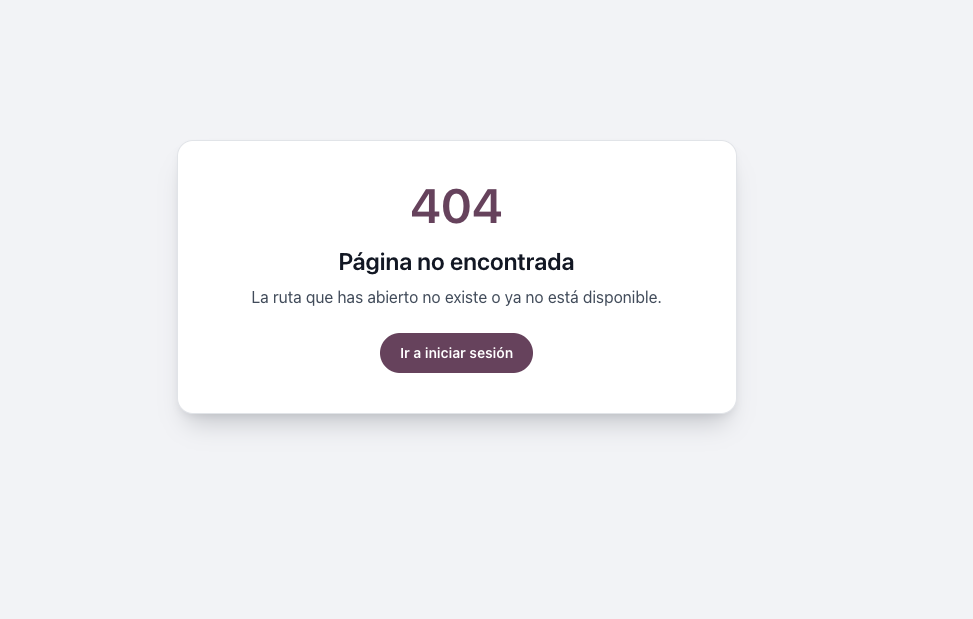

*Figura 11. Pantalla de error 404.*

---

## 8. Datos y limitaciones (versión actual)

| Aspecto | Comportamiento |
|--------|----------------|
| Backend | No hay API real; login, herramientas y perfil usan datos en memoria / mock. |
| Persistencia | Los cambios pueden reflejarse solo en la sesión del navegador mientras no recargues; no hay base de datos. |
| Seguridad | No sustituye a un sistema de autenticación real; es adecuado para demo y desarrollo frontend. |

---

## 9. Accesibilidad

- Enlace **Saltar al contenido principal** (visible al navegar con teclado).
- Etiquetas y roles ARIA en menú móvil, búsqueda y diálogos cuando aplica.
- Textos de error y mensajes de carga integrados en el sistema de idiomas.
