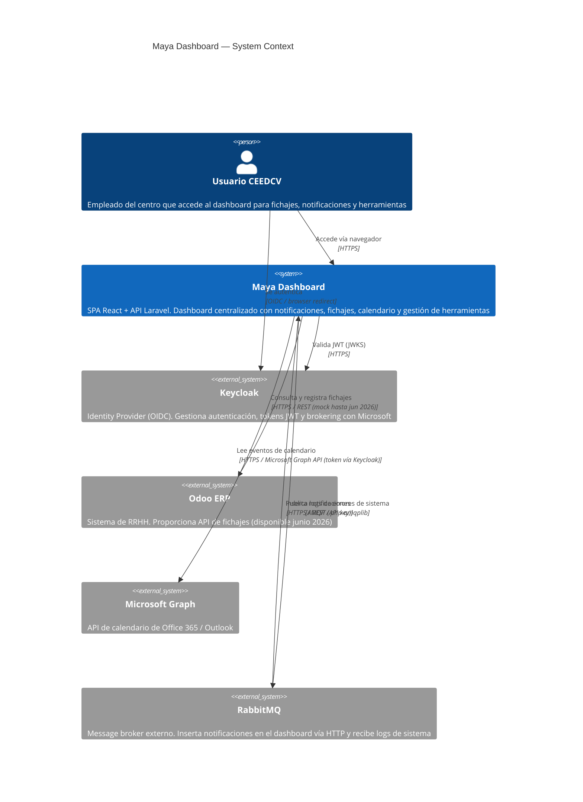
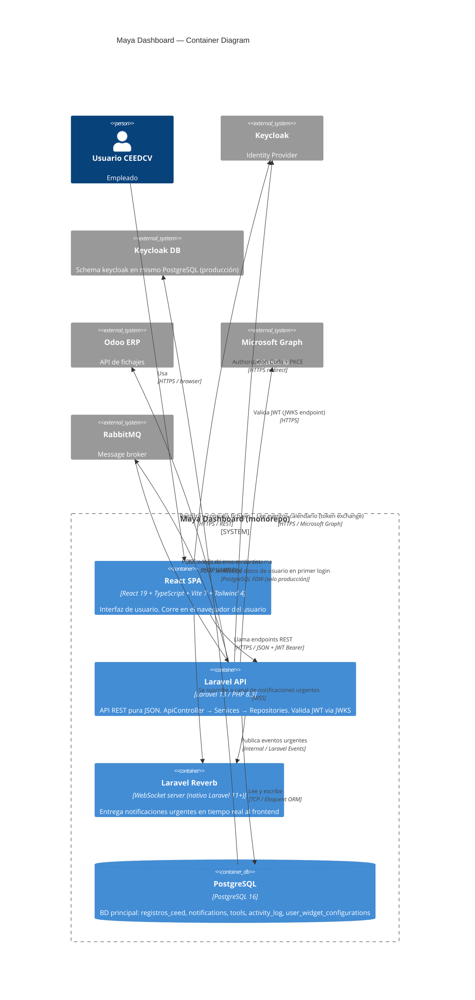

# Arquitectura y Riesgos — Maya Dashboard

> Generado: 2026-03-31 | Fase 2 — Arquitectura y Riesgos
> Skill: System Architect (C4 Model, STRIDE, OWASP Top 10, Twelve-Factor App)
> Fuente: `docs/src/0_descripcion_proyecto.md` · `docs/src/1_epics_and_features.md`

---

## 1. Requisitos No Funcionales (NFRs)

### 1.1 Escalabilidad

| Parámetro | Valor | Notas |
| --- | --- | --- |
| Usuarios concurrentes objetivo | 200 | Dimensionado para carga actual de CEEDCV |
| Crecimiento previsto | No definido | Monolito Laravel es suficiente a esta escala |
| Estrategia de escalado | Kubernetes horizontal (HPA) | CI/CD responsabilidad de infra |
| Estado de sesión | Stateless (JWT) | Sin sesiones en servidor; escala libremente |
| WebSocket | Laravel Reverb — single instance | A 200 usuarios, instancia única suficiente. Si crece, evaluar Redis adapter |
| Base de datos | PostgreSQL — una instancia | A 200 usuarios, vertical scaling suficiente en primera fase |

**Decisión:** El monolito Laravel con PostgreSQL y Reverb es apropiado para 200 usuarios concurrentes. La arquitectura Twelve-Factor (stateless, config en entorno, logs en stdout) facilita el escalado horizontal futuro en Kubernetes sin refactoring.

### 1.2 Disponibilidad

| Aspecto | Decisión |
| --- | --- |
| SLA objetivo | No definido formalmente. Objetivo razonable: 99.5% (downtime < 43h/año) |
| Deploy sin downtime | Rolling updates en Kubernetes |
| Dependencias externas críticas | Keycloak (bloquea login), Odoo (bloquea fichajes), RabbitMQ (bloquea notificaciones entrantes) |
| Degradación elegante | Odoo caído → modal de fichaje manual; Reverb caído → sin toasts urgentes (notificaciones en widget siguen disponibles) |
| Backup | Responsabilidad de infra (Kubernetes PVC + PostgreSQL backups) |

### 1.3 Rendimiento

| Métrica | Objetivo | Estrategia |
| --- | --- | --- |
| Tiempo de carga del dashboard | < 2s | Code splitting por ruta (React lazy), bundle optimizado con Vite, API responses cacheadas donde aplique |
| Latencia API backend | < 300ms p95 para endpoints principales | Queries optimizadas, índices en FK y campos de búsqueda frecuente |
| Notificaciones en tiempo real | < 1s desde inserción hasta toast | WebSocket persistente con Reverb |
| Audit log de escritura | No bloquea la respuesta al usuario | Escritura asíncrona post-respuesta (observer de Eloquent) |

### 1.4 Observabilidad

| Componente | Mecanismo |
| --- | --- |
| Logs de aplicación | `stdout` en contenedor → recogida por infra (Kubernetes log aggregation) |
| Logs de errores de sistema | Publicados a RabbitMQ vía `php-amqplib` (URL configurable por variable de entorno) |
| Audit log de acciones de usuario | `spatie/laravel-activitylog` → tabla `activity_log` en PostgreSQL. Retención: 1 año |
| Monitorización de performance | Sin herramienta definida (no bloquea MVP). Candidatos: Laravel Telescope en dev, Sentry en prod |
| WebSocket health | Reverb expone endpoint de status. Monitorizar desde infra |

### 1.5 Seguridad (baseline OWASP Top 10)

| Categoría | Control |
| --- | --- |
| Autenticación | Delegada a Keycloak. JWT validado en cada request via JWKS. Sin credenciales en la app |
| Autorización | Policies de Laravel por recurso. El campo `role` no es editable por el usuario (bug SEC-5 del REPORT) |
| Inyección (SQL) | Eloquent ORM con queries parametrizadas. Nunca concatenar SQL |
| XSS | React escapa por defecto. No usar `dangerouslySetInnerHTML`. CSP header en servidor |
| CSRF | API stateless con JWT en Authorization header (no cookies de sesión) → CSRF no aplica al API. Formularios HTML protegidos con SameSite |
| Datos sensibles | PII (IBAN, teléfono, dirección) solo en backend PostgreSQL, nunca en localStorage. HTTPS obligatorio |
| Rate limiting | Backend Laravel: máx 5 intentos de endpoints sensibles por IP/15min (respuesta 429) |
| Secretos | Variables de entorno exclusivamente (`.env` excluido de git). JWKS URL, API key RabbitMQ, DB credentials |
| Dependencias | `npm audit` y `composer audit` en CI. Actualizar regularmente |

---

## 2. Diagramas C4

### 2.1 Nivel 1 — System Context

### 2.2 Nivel 2 — Container Diagram

### 2.3 Notas de Decisión Tecnológica

| Decisión | Alternativa Descartada | Justificación |
| --- | --- | --- |
| Monolito Laravel vs microservicios | Microservicios separados para notificaciones y auditoría | Solo el dashboard consume estos servicios actualmente. El monolito reduce complejidad operativa sin sacrificar mantenibilidad |
| Laravel Reverb vs Pusher/Ably | Pusher (SaaS externo) | Reverb es nativo de Laravel 11+, sin coste externo ni dependencia de terceros para 200 usuarios |
| PostgreSQL vs MySQL | MySQL/MariaDB | FDW con Keycloak requiere PostgreSQL obligatoriamente. No hay opción alternativa |
| JWT stateless vs sesiones Laravel | Laravel Session + cookies | Stateless es imprescindible para Kubernetes horizontal scaling y para la arquitectura Keycloak |
| SPA React vs SSR (Next.js/Inertia) | Inertia.js + SSR | Cliente ya tiene codebase React con feature-driven architecture. Separar SPA del API es correcto para este caso |

---

## 3. Análisis de Amenazas STRIDE

### Componentes críticos analizados

| Componente | Categoría |
| --- | --- |
| Endpoint de autenticación / JWT flow | Security |
| Endpoint REST de inserción de notificaciones (API key) | Integration |
| API de fichajes (datos laborales sensibles) | Logic / Business |
| Datos de perfil (IBAN, PII) | Data |
| WebSocket Reverb (notificaciones urgentes) | Integration |
| Audit log | Observability |

---

#### STRIDE-01 — Endpoint de Autenticación / JWT Flow

| Amenaza | Vector | Mitigación | Backlog |
| --- | --- | --- | --- |
| **S — Spoofing** | Token JWT forjado o manipulado | Validar firma via JWKS endpoint de Keycloak en cada request. Rechazar tokens expirados o con issuer incorrecto | F-01.2 |
| **T — Tampering** | Modificación del payload JWT (ej. elevar `role`) | La firma HMAC/RSA invalida cualquier modificación. Claims solo de lectura en Laravel | F-01.2 |
| **R — Repudiation** | Usuario niega haber iniciado sesión | Audit log de LOGIN con user_id, IP y timestamp inmutable | F-08.1 |
| **I — Information Disclosure** | Token filtrado en logs o URL query string | JWT solo en `Authorization: Bearer` header. Nunca en URL. Logs sanitizados (no loggear tokens) | F-01.1, F-01.4 |
| **D — Denial of Service** | Flood de requests a endpoints de auth | Rate limiting: máx 5 intentos/IP/15min en endpoints de autenticación. Respuesta 429 | F-01.1 |
| **E — Elevation of Privilege** | Modificar claim `role` en frontend para obtener permisos de admin | Backend rechaza cualquier claim de rol no emitido por Keycloak. Campo `role` no editable por usuario (ver bug SEC-5 del REPORT) | F-01.2 |

---

#### STRIDE-02 — Endpoint REST de Inserción de Notificaciones (API key)

| Amenaza | Vector | Mitigación | Backlog |
| --- | --- | --- | --- |
| **S — Spoofing** | Actor externo suplanta a RabbitMQ enviando notificaciones falsas | API key única en header `X-Api-Key`. Almacenada como variable de entorno, no en c��digo. Rotar ante compromiso | F-03.1 |
| **T — Tampering** | Manipulación del payload (prioridad, action_url maliciosa) | Validar y sanitizar todos los campos del payload en Laravel Request. Whitelist de action_url schemas (solo http/https) | F-03.1 |
| **R — Repudiation** | No hay traza de qué sistema insertó qué notificación | Registrar `source_system` y timestamp en cada notificación insertada | F-03.1 |
| **I — Information Disclosure** | API key expuesta en logs o repositorio | API key solo en `.env`. Nunca en código, nunca en logs. `.env` excluido de git | F-03.1 |
| **D — Denial of Service** | Flood de notificaciones desde RabbitMQ o actor externo | Rate limiting en el endpoint de inserción. Idempotencia por `external_id` previene duplicados por reintento | F-03.1 |
| **E — Elevation of Privilege** | Insertar notificación con `user_id` de otro usuario para spam dirigido | Validar que el `user_id` del payload existe en `registros_ceed`. No aceptar user_id inválidos | F-03.1, F-03.2 |

---

#### STRIDE-03 — API de Fichajes (datos laborales)

| Amenaza | Vector | Mitigación | Backlog |
| --- | --- | --- | --- |
| **S — Spoofing** | Fichar en nombre de otro usuario | El JWT Bearer identifica al usuario. El backend extrae `user_id` del token, nunca del body del request | F-04.1, F-04.2 |
| **T — Tampering** | Modificar respuesta del mock de Odoo para falsificar fichajes | El mock solo se usa en entorno local. En producción, la respuesta es de Odoo directamente. Audit log de cada fichaje | F-04.1, F-08.1 |
| **R — Repudiation** | Usuario niega haber fichado | Audit log con user_id, tipo de acción, timestamp y respuesta de Odoo | F-08.1 |
| **I — Information Disclosure** | Histórico de fichajes de otro usuario | El endpoint solo devuelve fichajes del usuario autenticado (extraído del JWT). Sin parámetro `user_id` en query | F-04.1 |
| **D — Denial of Service** | Requests masivos a Odoo degradan el ERP | Circuit breaker o timeout en la capa de integración con Odoo. Respuesta 503 con mensaje apropiado si Odoo no responde | F-04.1 |
| **E — Elevation of Privilege** | No aplica — sin escalada posible en esta feature | — | — |

---

#### STRIDE-04 — Datos de Perfil (IBAN, PII)

| Amenaza | Vector | Mitigación | Backlog |
| --- | --- | --- | --- |
| **S — Spoofing** | Editar perfil de otro usuario | Policy de Laravel: solo el propietario puede editar su perfil. Extraer user_id del JWT | F-07.1, F-07.3 |
| **T — Tampering** | Inyección SQL a través de campos del perfil | Eloquent ORM con queries parametrizadas. Validación estricta de tipos en FormRequest | F-07.1, F-07.2, F-07.3 |
| **R — Repudiation** | Usuario niega haber cambiado su IBAN | Audit log de cada campo sensible editado con valor anterior | F-08.1 |
| **I — Information Disclosure** | IBAN o PII expuesto en logs o responses de error | Campos sensibles omitidos de logs. Responses de error no incluyen valores de campos. HTTPS obligatorio | F-07.1, F-07.3 |
| **D — Denial of Service** | No aplica a nivel de endpoint de perfil | — | — |
| **E — Elevation of Privilege** | El campo `role` es editable en el perfil del codebase actual (bug SEC-5) | Eliminar `role` del formulario editable. Solo lectura en UI. Backend rechaza cualquier intento de cambiar rol | F-07.1 |

---

#### STRIDE-05 — WebSocket Reverb (notificaciones urgentes)

| Amenaza | Vector | Mitigación | Backlog |
| --- | --- | --- | --- |
| **S — Spoofing** | Cliente no autenticado se suscribe a canal de notificaciones de otro usuario | Canal privado en Reverb: `private-notifications.{user_id}`. El backend autoriza la suscripción validando el JWT | F-03.3 |
| **T — Tampering** | Inyección de eventos WebSocket maliciosos | Los eventos solo se publican desde el backend Laravel. El cliente solo puede escuchar, no publicar | F-03.3 |
| **I — Information Disclosure** | Notificaciones de usuario A visibles para usuario B | Canales privados con autorización server-side. El frontend no puede suscribirse a canales ajenos | F-03.3 |
| **D — Denial of Service** | Flood de conexiones WebSocket | Límite de conexiones en Reverb (configurable). Rate limiting a nivel de infraestructura (Kubernetes ingress) | F-03.3 |

---

#### STRIDE-06 — Audit Log

| Amenaza | Vector | Mitigación | Backlog |
| --- | --- | --- | --- |
| **T — Tampering** | Modificación o eliminación de registros de auditoría | La tabla `activity_log` es append-only. Permisos de BD: la aplicación tiene INSERT pero no UPDATE/DELETE en esta tabla | F-08.1 |
| **R — Repudiation** | Actor malicioso borra rastro de acciones | Registros de audit son inmutables. La limpieza por retención (1 año) se realiza via job programado con log propio | F-08.1 |
| **I — Information Disclosure** | Audit log accesible por usuarios no autorizados | En MVP: cada usuario solo ve su propio historial. Policy de Laravel filtra por user_id autenticado | F-08.1, F-08.2 |

---

## 4. Riesgos Arquitectónicos Identificados

| ID | Riesgo | Probabilidad | Impacto | Mitigación | Feature Afectada |
| --- | --- | --- | --- | --- | --- |
| RISK-01 | Odoo API no disponible en la fecha prevista (junio 2026) | Media | Alto | Mock con interfaz desacoplada (`OdooFichajesAdapter`). Swap sin modificar negocio | F-04.1 |
| RISK-02 | URL de RabbitMQ para logs de sistema nunca confirmada | Media | Bajo | Config por variable de entorno. Si no llega, el canal de logs simplemente no se activa | F-08.3 |
| RISK-03 | Keycloak realm con claim mappers incompletos | Alta | Alto | Verificar en `IaC.git` antes de implementar F-01.2. Documentar mappers necesarios en F-09.2 | F-01.2, F-09.2 |
| RISK-04 | Dominio de producción no definido (redirect URIs Keycloak) | Alta | Alto | Parametrizar URIs por entorno (variable de entorno). Bloquea despliegue a producción si no se confirma | F-01.1, F-09.1 |
| RISK-05 | Laravel Reverb bajo carga > 200 conexiones simultáneas | Baja | Medio | A 200 usuarios no todos están conectados simultáneamente. Monitorizar; evaluar Redis adapter si escala | F-03.3 |
| RISK-06 | FDW en producción: schema de Keycloak puede cambiar tras actualización | Baja | Medio | Acotar el FDW a campos mínimos (nombre, email). No depender de la estructura interna de Keycloak | F-01.3 |
| RISK-07 | `spatie/laravel-activitylog` genera volumen alto en tabla `activity_log` | Media | Bajo | Índices en `causer_id` y `created_at`. Job de limpieza programado cada semana (eliminar > 1 año) | F-08.1 |
| RISK-08 | Token Exchange RFC 8693 (Microsoft) no soportado por versión actual de Keycloak del realm | Media | Medio | Verificar versión de Keycloak en `IaC.git`. Si < 18, Token Exchange puede estar en preview. Alternativa: OAuth2 directo desde frontend (cambia arquitectura de F-05.2) | F-05.2 |

---

## 5. Categorización por Área (trazabilidad con Backlog)

| Categoría | Componentes | Features |
| --- | --- | --- |
| `Security` | Keycloak OIDC flow, JWT validation, API key notificaciones, Policies Laravel | F-01.1, F-01.2, F-01.4, F-05.2 |
| `Integration` | Odoo adapter (mock/real), RabbitMQ (AMQP salida + HTTP entrada), Microsoft Graph, Reverb | F-03.1, F-03.3, F-04.1, F-05.1, F-05.2, F-08.3 |
| `Data` | PostgreSQL, FDW, registros_ceed, activity_log, notifications, tools, matrículas | F-01.3, F-07.2 |
| `Logic / Business` | Fichaje actions, Notification management, Tools CRUD, Favorites, IBAN validation | F-03.2, F-04.2, F-06.2, F-06.3, F-07.3 |
| `UI / Presentation` | Dashboard layout, widgets, sidebar, responsive, toast | F-02.1, F-02.2, F-02.3, F-02.4, F-03.4, F-04.3, F-05.3, F-06.1, F-06.4, F-07.1, F-08.2 |
| `Infrastructure` | Docker Compose, Kubernetes, PostgreSQL shared, variables de entorno | F-09.1, F-09.2 |
| `Observability` | Audit log, logs de sistema a RabbitMQ, Reverb health | F-08.1, F-08.2, F-08.3 |
| `DX / Tooling` | TypeScript config, Tailwind + tokens Odoo 19, i18n, dark mode | F-09.3, F-09.4 |
