# Diagramas C4 y Flujos — Maya Dashboard

> Generado: 2026-03-31 | Fase 4 — Documentación Visual
> Skill: System Architect (C4 Model, Mermaid)
> Fuente: `docs/src/2_architecture_risks.md` · `docs/src/1_epics_and_features.md`

---

## 1. C4 — Nivel 1: System Context

> Visión de alto nivel. Muestra el sistema en relación con los usuarios y sistemas externos que lo rodean.

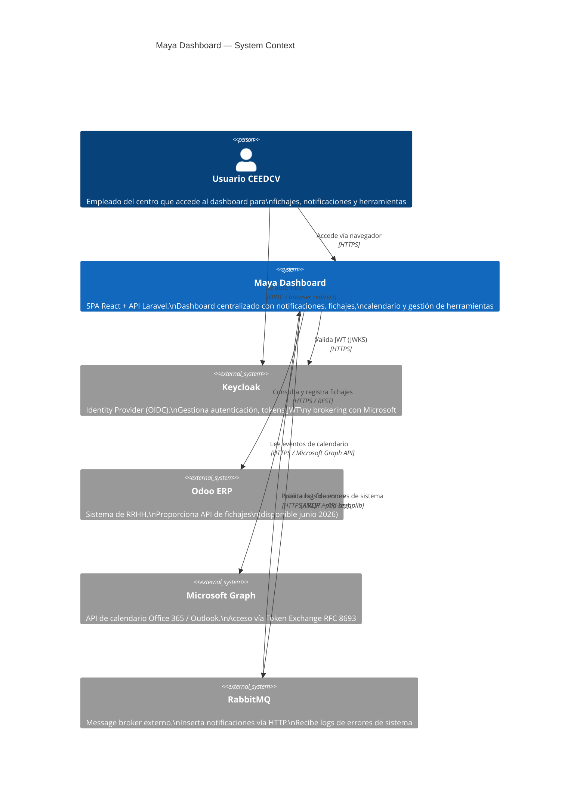

---

## 2. C4 — Nivel 2: Container Diagram

> Descomposición en contenedores (aplicaciones, bases de datos, servidores). Muestra responsabilidades y protocolos de comunicación.

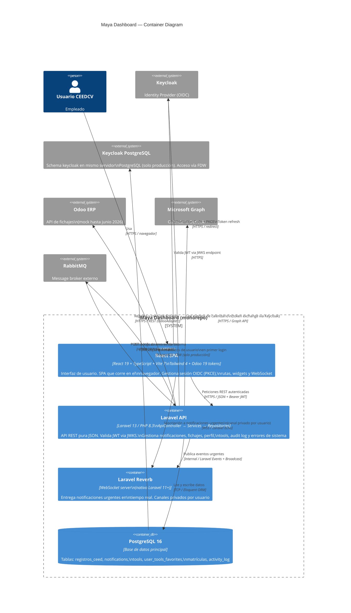

---

## 3. C4 — Nivel 3: Component Diagram — Laravel API

> Descomposición interna del contenedor Laravel API. Muestra los componentes principales y sus relaciones internas.

```mermaid
C4Component
  title Laravel API — Component Diagram

  Container_Ext(spa, "React SPA", "Frontend")
  Container_Ext(reverb, "Laravel Reverb", "WebSocket server")
  ContainerDb_Ext(db, "PostgreSQL", "Base de datos")
  System_Ext(keycloak, "Keycloak JWKS", "Identity Provider")
  System_Ext(odoo, "Odoo ERP", "API Fichajes")
  System_Ext(microsoft, "Microsoft Graph", "Calendario")
  System_Ext(rabbitmq, "RabbitMQ", "Message broker")

  Container_Boundary(api, "Laravel API") {

    Component(middleware_jwt, "JwtAuthMiddleware", "Laravel Middleware\n(firebase/php-jwt)", "Valida Bearer JWT en cada request.\nExtrae user_id del claim 'email'.\nRechaza tokens expirados o con issuer incorrecto")

    Component(middleware_apikey, "ApiKeyMiddleware", "Laravel Middleware", "Valida API key para el endpoint\nde inserción de notificaciones.\nExcluye este endpoint del JwtAuthMiddleware")

    Component(auth_controller, "AuthController", "ApiController", "Gestiona sincronización de usuario\nen primer login via FDW o claims JWT")

    Component(notif_controller, "NotificationController", "ApiController", "CRUD de notificaciones.\nEndpoint de inserción con idempotencia (external_id).\nAcciones de leída/todas leídas")

    Component(fichaje_controller, "FichajeController", "ApiController", "Acciones de entrada/salida.\nDelegas al OdooFichajesAdapter")

    Component(profile_controller, "ProfileController", "ApiController", "Vista y edición de registros_ceed.\nGestión de matrículas.\nEdición IBAN con validación europea")

    Component(tools_controller, "ToolsController", "ApiController", "CRUD del catálogo de Tools.\nGestión de favoritos con orden")

    Component(audit_controller, "AuditController", "ApiController", "Historial de acciones del usuario autenticado.\nFiltrado por user_id via Policy")

    Component(odoo_adapter, "OdooFichajesAdapter", "Service / Interface + Impl", "Abstracción de la API de Odoo.\nMock activo hasta junio 2026.\nSwap sin modificar controladores")

    Component(calendar_provider, "CalendarProvider", "Service / Interface + Impl", "Abstracción para calendarios.\nImplementación MicrosoftGraphCalendarProvider.\nToken Exchange RFC 8693 via Keycloak")

    Component(notification_service, "NotificationService", "Service", "Lógica de creación y gestión de notificaciones.\nDispara broadcast a Reverb si priority=urgente")

    Component(audit_observer, "ActivityLogObserver", "Eloquent Observer\n(spatie/laravel-activitylog)", "Registra automáticamente cambios\nen campos sensibles. Append-only.\nLimpieza automática tras 1 año")

    Component(rabbitmq_publisher, "RabbitMqErrorPublisher", "Service\n(php-amqplib)", "Publica errores de sistema a RabbitMQ.\nURL configurable por variable de entorno.\nFallo silencioso si RabbitMQ no disponible")
  }

  Rel(spa, middleware_jwt, "Cada request REST", "Bearer JWT")
  Rel(rabbitmq, middleware_apikey, "POST /api/notifications", "X-Api-Key header")
  Rel(middleware_jwt, auth_controller, "")
  Rel(middleware_jwt, notif_controller, "")
  Rel(middleware_jwt, fichaje_controller, "")
  Rel(middleware_jwt, profile_controller, "")
  Rel(middleware_jwt, tools_controller, "")
  Rel(middleware_jwt, audit_controller, "")
  Rel(middleware_apikey, notif_controller, "")
  Rel(middleware_jwt, keycloak, "Valida JWT via JWKS", "HTTPS")
  Rel(auth_controller, db, "INSERT registros_ceed (primer login)", "Eloquent")
  Rel(notif_controller, notification_service, "")
  Rel(notification_service, db, "INSERT notifications", "Eloquent")
  Rel(notification_service, reverb, "Broadcast si urgente", "Laravel Events")
  Rel(fichaje_controller, odoo_adapter, "")
  Rel(odoo_adapter, odoo, "REST (o mock)", "HTTPS")
  Rel(profile_controller, db, "UPDATE registros_ceed / matrículas", "Eloquent")
  Rel(profile_controller, audit_observer, "Campos sensibles auditados automáticamente", "Observer")
  Rel(tools_controller, db, "CRUD tools / user_tools_favorites", "Eloquent")
  Rel(audit_controller, db, "SELECT activity_log (solo propio)", "Eloquent + Policy")
  Rel(calendar_provider, microsoft, "GET /calendar/events", "HTTPS / Graph API")
  Rel(audit_observer, db, "INSERT activity_log (append-only)", "Eloquent")
  Rel(rabbitmq_publisher, rabbitmq, "AMQP publish", "php-amqplib")
```

---

## 4. Flujos Secuenciales

### 4.1 Flujo de Autenticación — Login OIDC con PKCE

> Covers: F-01.1, F-01.2, F-01.3, F-01.4

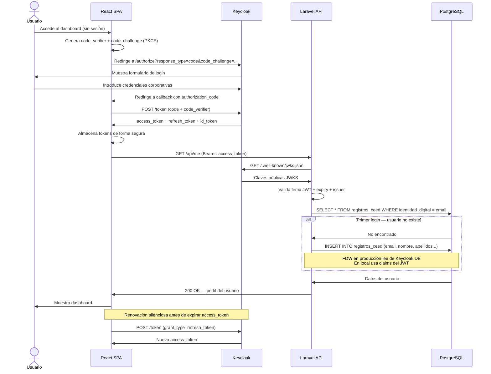

---

### 4.2 Flujo de Inserción y Entrega de Notificación Urgente

> Covers: F-03.1, F-03.2, F-03.3, F-03.4

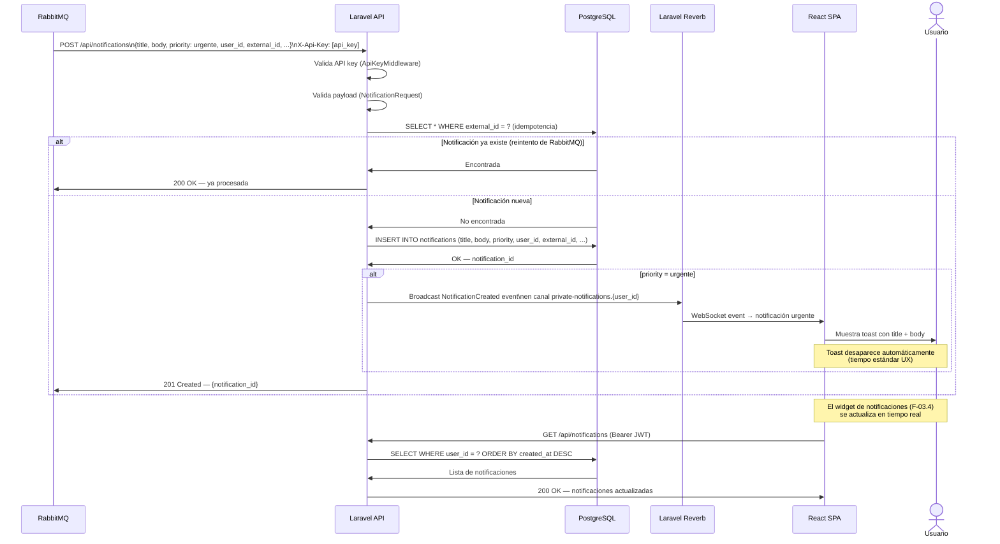

---

### 4.3 Flujo de Fichaje — Entrada con Mock de Odoo

> Covers: F-04.1, F-04.2, F-04.3, F-02.2

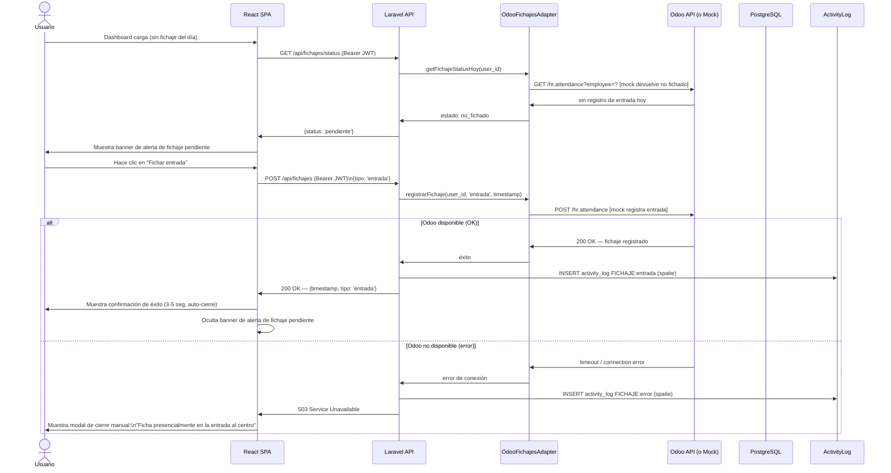

---

### 4.4 Flujo de Sincronización FDW — Primer Login

> Covers: F-01.3

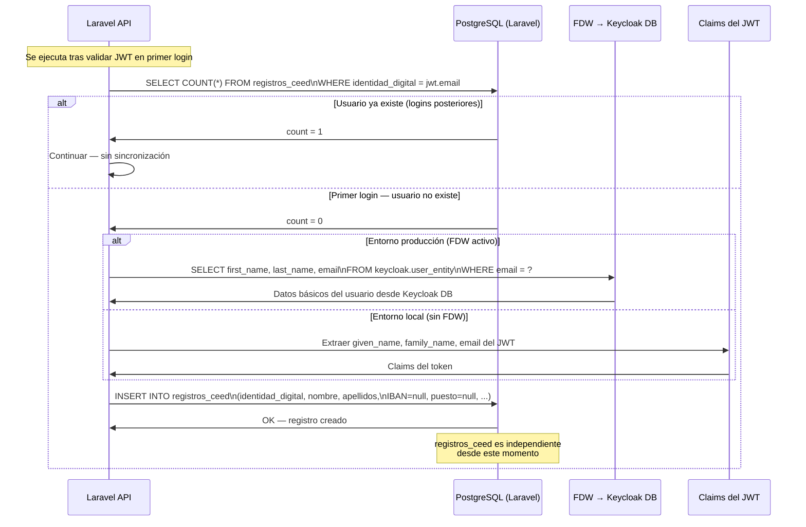

---

### 4.5 Flujo de Gestión de Tools y Favoritos

> Covers: F-06.2, F-06.3, F-06.4, F-06.1

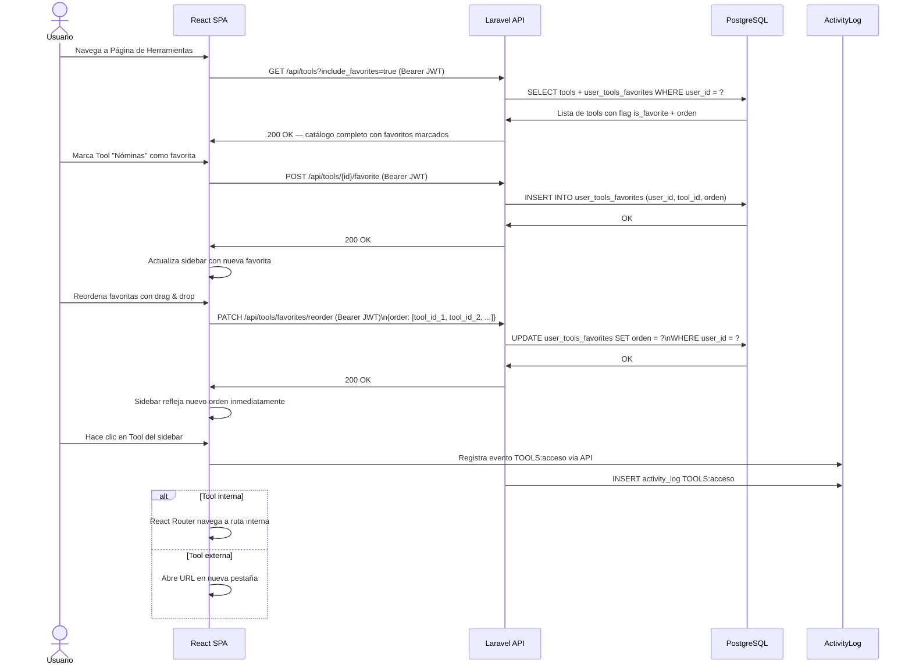

---

### 4.6 Flujo de Edición de Perfil con Auditoría

> Covers: F-07.1, F-07.2, F-07.3, F-08.1

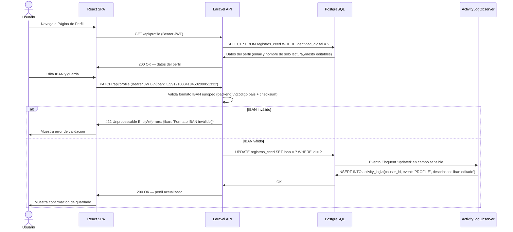

---

## 5. Modelo de Datos — Tablas Principales

> Referencia rápida del esquema de BD. Las migraciones son responsabilidad del equipo de backend.

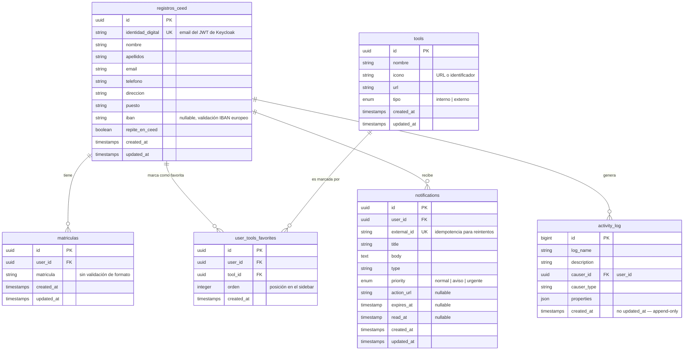

---

## 6. Infraestructura Local — Docker Compose

> Topología del entorno de desarrollo local. Sin Keycloak ni RabbitMQ de producción.

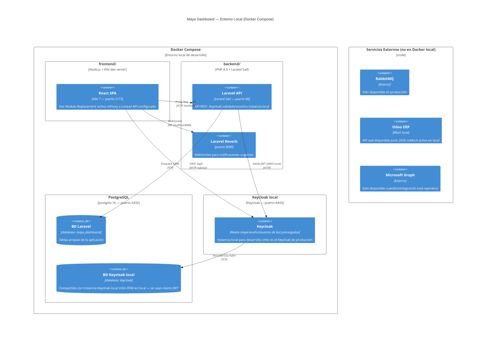

---

## 7. Notas de Implementación

### 7.1 Entornos y configuración

| Variable de entorno | Uso | Quién la define |
| --- | --- | --- |
| `KEYCLOAK_JWKS_URI` | URL del JWKS endpoint de Keycloak para validar tokens JWT | Backend |
| `KEYCLOAK_ISSUER` | Issuer esperado en el JWT (URL del realm) | Backend |
| `NOTIFICATION_API_KEY` | API key para el endpoint de inserción de notificaciones | Backend |
| `RABBITMQ_LOGS_URL` | URL del broker RabbitMQ para publicar logs de sistema (pendiente de infra) | Backend |
| `ODOO_API_URL` | URL de la API Odoo (mock en local, real en producción) | Backend |
| `VITE_KEYCLOAK_URL` | URL base del servidor Keycloak | Frontend |
| `VITE_KEYCLOAK_REALM` | Nombre del realm Keycloak | Frontend |
| `VITE_KEYCLOAK_CLIENT_ID` | Client ID del cliente público frontend en Keycloak | Frontend |
| `VITE_API_URL` | URL base de la API Laravel | Frontend |

### 7.2 Secuencia de implementación recomendada por sprints

| Sprint | Features | Objetivo |
| --- | --- | --- |
| Sprint 1 | F-09.1, F-09.2, F-09.4, F-01.1, F-01.2, F-01.3, F-01.4 | Infraestructura base + autenticación completa |
| Sprint 2 | F-02.1, F-02.3, F-03.1, F-04.1, F-06.2, F-08.1, F-08.3 | Layout, CRUD base, integraciones y auditoría |
| Sprint 3 | F-02.2, F-03.2, F-03.3, F-03.4, F-04.2, F-04.3, F-06.1, F-06.3, F-06.4, F-07.1, F-07.2 | Módulos funcionales completos |
| Sprint 4 | F-02.4, F-05.1, F-07.3, F-08.2, F-09.3 | Mejoras UX, perfil completo, provider calendario |
| Sprint 5 | F-05.2, F-05.3 | Integración Microsoft Graph (Could) |

### 7.3 Dependencias críticas de disponibilidad externa

| Dependencia | Estado | Impacto si no disponible | Mitigación |
| --- | --- | --- | --- |
| Odoo API | No disponible hasta junio 2026 | Módulo de fichajes bloqueado | Mock desacoplado (F-04.1) |
| RabbitMQ URL (logs) | URL no confirmada | Logs de sistema no se publican | Config por entorno, fallo silencioso |
| Dominio de producción | Pendiente de infra | Redirect URIs Keycloak incorrectos | Parametrizar por variable de entorno |
| Token Exchange Microsoft | Depende de versión de Keycloak | Widget de calendario no disponible | Widget omitido de UI (F-05.3) hasta activación |
